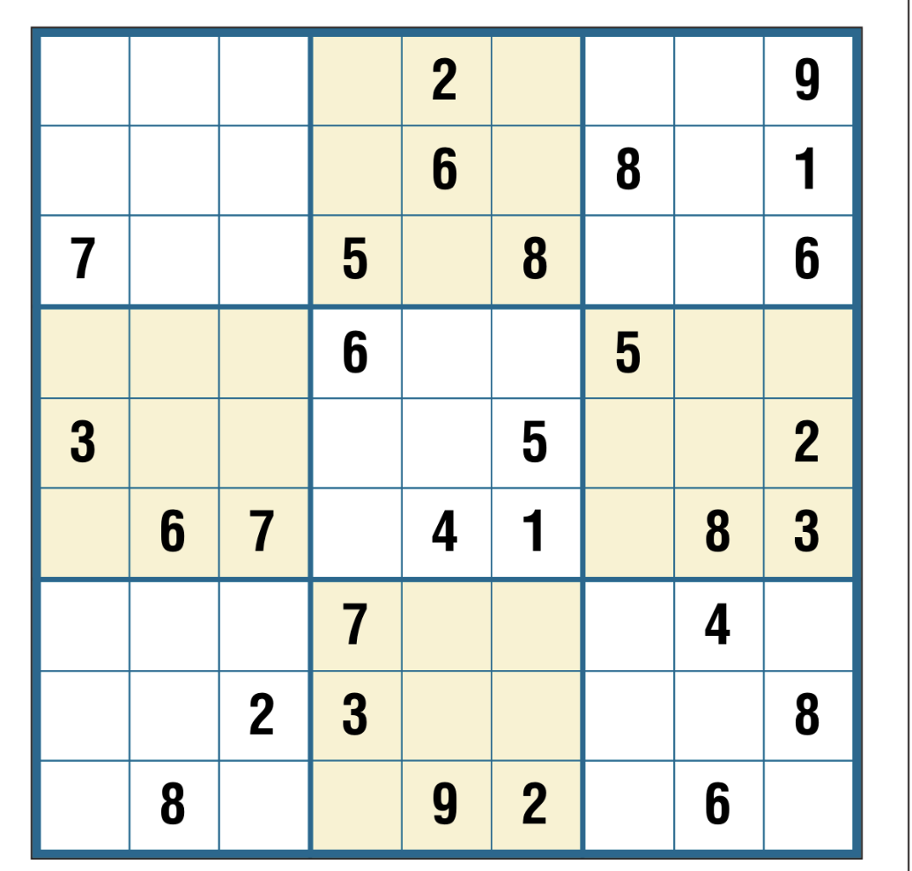

# SAT Sudoku Solver

This project is a Sudoku solver that uses a combination of computer vision and a SAT solver to solve Sudoku puzzles from an image.

## How it works

1.  Preprocessing: The input image is processed using OpenCV to detect the Sudoku board and warp it into a top-down perspective.
2.  Cell Detection: The individual cells of the Sudoku grid are detected and cut out to be used later on.
3.  OCR: The digits in the cells are recognized using doctr's vitstr-small.
4.  SAT-Solving: The Sudoku puzzle is converted into a satisfiability problem (SAT) and solved using the Kissat SAT solver.
5.  Solution Rendering: The sat-compiled solution is rendered back onto the original image.

## Examples

Here's an example of the solver in action:

**Input Image:**

**Output Image:**

